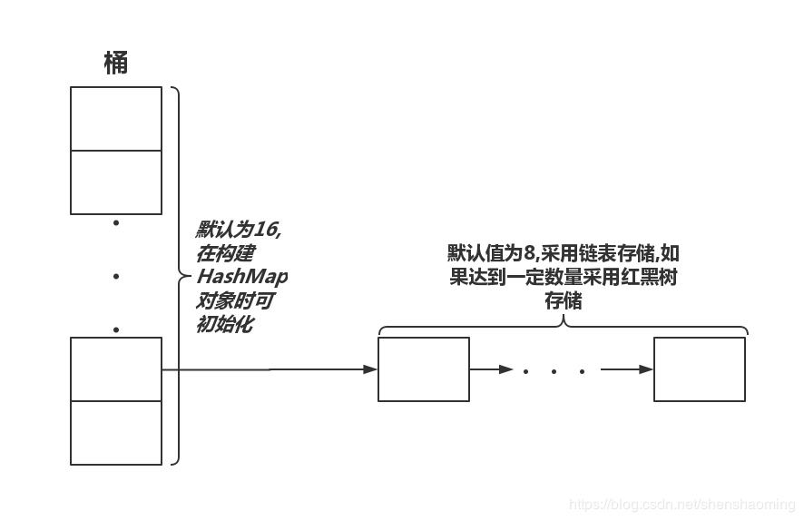
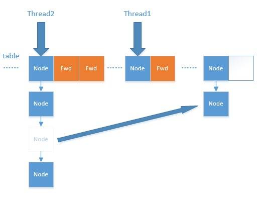

# 1. HashMap(JDK8)
[第三方链表和红黑树分析](https://blog.csdn.net/shenshaoming/article/details/95469460)

## 特性
1. 默认**初始长度为16**，数组**长度必须是2的幂**（为了key映射到index时候的hash算法更高效，通过`（n-1）& hash`值的位运算，**等效于取模**），扩容是之前容量的两倍
2. hash算法结果是均匀的，即能保证index较为均匀；java8的hash算法通过基于`key.hashcode()`，将其**高16位和低16位做异或（`h ^ h>>>16`）**，这个综合考虑了速度，作用和质量
3. java7 hash碰撞通过链表解决，总是**添加到链头**（设计者认为后插入的数据被查找的可能性大）；java8在链表的长度**超过8（`binCount >= TREEIFY_THRESHOLD - 1`，`binCount`从0开始计数），将链表转为红黑树**(**查找效率快，时间复杂度O（logN）**)，并没有解决hash碰撞的问题，只是通过红黑树优秀的查找性能来解决问题
4. 扩容是创建新长度数组，然后将原数组内容**重新计算index**后放入新数组；java8 仅重新计算index，省略重新计算hash过程，所以新index要么等于原index，要么原index加上原长（这点从index的位运算可以看出）；resize的过程，均匀的把之前的冲突的节点分散到新的bucket了
5. 高并发下出现链表的环形结构。当调用`get`查找一个**不存在的Key**，而这个Key的Hash结果恰好在index位置的时候，由于位置index处带有环形链表，所以程序将会进入死循环（链表中不存在元素，一直遍历）！

## 1.1 put的实现
put函数大致的思路为：
1. 对`key.hashCode()`做异或hash，然后再计算index;
2. 如果索引index处**没碰撞直接放到bucket里**；
3. 如果碰撞了，**以链表的形式存在buckets里，添加到链尾**；
4. 如果碰撞导致链表过长(大于等于TREEIFY_THRESHOLD=8)，就把**链表转换成红黑树(当整个HashMap内数组长度未超过64时，不会红黑树化，通过扩容`resize()`解决频繁碰撞更为合适)**；
5. 如果**节点已经存在就替换old value**(保证key的唯一性)
6. 如果bucket数组将满(超过`load factor*current capacity`)，就要`resize()`。
结合代码分析：
```java
public V put(K key, V value) {
    return putVal(hash(key), key, value, false, true);
}

/**
 * hashMap的hash算法
 */
static final int hash(Object key) {
    int h;
    return (key == null) ? 0 : (h = key.hashCode()) ^ (h >>> 16);// key的hash值，高16位与低16位异或    
}

final V putVal(int hash, K key, V value, boolean onlyIfAbsent,
               boolean evict) {
    Node<K,V>[] tab; // hash桶数组
    Node<K,V> p; // 哨兵p
    int n, i;
    // 数组tab为空（即桶数组还未初始化）则创建桶数组
    if ((tab = table) == null || (n = tab.length) == 0)
        n = (tab = resize()).length;
        
    // 计算索引index，让哨兵p指向这个桶；桶内暂无数据，则构造数据节点并在index位置的桶存入
    if ((p = tab[i = (n - 1) & hash]) == null)
        tab[i] = newNode(hash, key, value, null);
        
    // 索引index位置已存在数据，发生碰撞
    else {
        // 查找哨兵e
        Node<K,V> e; K k;
        // 判断是同一个节点存入的情况
        if (p.hash == hash &&
            ((k = p.key) == key || (key != null && key.equals(k))))
            e = p;
        // 该链为红黑树
        else if (p instanceof TreeNode)
            e = ((TreeNode<K,V>)p).putTreeVal(this, tab, hash, key, value);
        // 该链为链表
        else {
            for (int binCount = 0; ; ++binCount) {
                // 遍历单链表（链上可能仅有一个链头元素），根据key和hash查找
                if ((e = p.next) == null) {
                    // java8是直接放在链表尾部的，和java7不同
                    p.next = newNode(hash, key, value, null);
                    
                    // 转成红黑树
                    if (binCount >= TREEIFY_THRESHOLD - 1) // -1 for 1st， TREEIFY_THRESHOLD=8
                        treeifyBin(tab, hash);
                    break;
                }
                
                // 根据hash&key查找到链上对应节点e
                if (e.hash == hash &&
                    ((k = e.key) == key || (key != null && key.equals(k))))
                    break;
                    
                // 这一步很重要，遍历链表的关键，否则无法完成遍历
                p = e;
            }
        }
        
        // 已存在节点，则覆盖写入新值
        if (e != null) { // existing mapping for key
            V oldValue = e.value;
            // onlyIfAbsent在put时为false，覆盖
            if (!onlyIfAbsent || oldValue == null)
                e.value = value;
                
            // 这个方法主要是为LinkedHashMap设计的，后续LinkedHashMap内介绍
            afterNodeAccess(e);
            return oldValue;
        }
    }
    ++modCount;
    // 超过load factor*current capacity，resize
    if (++size > threshold)
        resize();
        
    // 这个方法主要是为LinkedHashMap设计的，后续LinkedHashMap内介绍
    afterNodeInsertion(evict);
    return null;
}

/**
 * 链表转成红黑树
 */
final void treeifyBin(Node<K,V>[] tab, int hash) {
    int n, index; Node<K,V> e;
    // tab表为空或者长度小于64，则扩容
    if (tab == null || (n = tab.length) < MIN_TREEIFY_CAPACITY) // MIN_TREEIFY_CAPACITY=64
        resize();
    // tab表长度超过或等于64
    else if ((e = tab[index = (n - 1) & hash]) != null) {
        TreeNode<K,V> hd = null, tl = null;
        do {
            TreeNode<K,V> p = replacementTreeNode(e, null);
            if (tl == null)
                hd = p;
            else {
                p.prev = tl;
                tl.next = p;
            }
            tl = p;
        } while ((e = e.next) != null);
        if ((tab[index] = hd) != null)
            hd.treeify(tab);
    }
}
```

## 1.2 如何扩容？
```java
/**
 * 扩容
 */
final Node<K,V>[] resize() {
    Node<K,V>[] oldTab = table;
    int oldCap = (oldTab == null) ? 0 : oldTab.length;
    int oldThr = threshold;
    int newCap, newThr = 0;
    if (oldCap > 0) {
        // 超过最大值就不再扩充了，就只好随你碰撞去吧
        if (oldCap >= MAXIMUM_CAPACITY) {
            threshold = Integer.MAX_VALUE;
            return oldTab;
        }
        // 没超过最大值，就扩充为原来的2倍
        else if ((newCap = oldCap << 1) < MAXIMUM_CAPACITY &&
                 oldCap >= DEFAULT_INITIAL_CAPACITY)
            newThr = oldThr << 1; // double threshold
    }
    else if (oldThr > 0) // initial capacity was placed in threshold
        newCap = oldThr;
    else {               // zero initial threshold signifies using defaults
        newCap = DEFAULT_INITIAL_CAPACITY;
        newThr = (int)(DEFAULT_LOAD_FACTOR * DEFAULT_INITIAL_CAPACITY);
    }
    
    // 计算新的resize上限
    if (newThr == 0) {
        float ft = (float)newCap * loadFactor;
        newThr = (newCap < MAXIMUM_CAPACITY && ft < (float)MAXIMUM_CAPACITY ?
                  (int)ft : Integer.MAX_VALUE);
    }
    threshold = newThr;
    @SuppressWarnings({"rawtypes","unchecked"})
        Node<K,V>[] newTab = (Node<K,V>[])new Node[newCap];
    table = newTab;
    if (oldTab != null) {
        // 把每个bucket都移动到新的buckets中
        for (int j = 0; j < oldCap; ++j) {
            Node<K,V> e;
            if ((e = oldTab[j]) != null) {
                oldTab[j] = null;// 原hash桶清理
                if (e.next == null)
                    newTab[e.hash & (newCap - 1)] = e;
                else if (e instanceof TreeNode)
                    ((TreeNode<K,V>)e).split(this, newTab, j, oldCap);
                else { // preserve order
                    Node<K,V> loHead = null, loTail = null;
                    Node<K,V> hiHead = null, hiTail = null;
                    Node<K,V> next;
                    do {
                        next = e.next;
                        // 原索引
                        if ((e.hash & oldCap) == 0) {
                            if (loTail == null)
                                loHead = e;
                            else
                                loTail.next = e;
                            loTail = e;
                        }
                        // 原索引+oldCap
                        else {
                            if (hiTail == null)
                                hiHead = e;
                            else
                                hiTail.next = e;
                            hiTail = e;
                        }
                    } while ((e = next) != null);
                    // 原索引放到bucket里
                    if (loTail != null) {
                        loTail.next = null;
                        newTab[j] = loHead;
                    }
                    // 原索引+oldCap放到bucket里
                    if (hiTail != null) {
                        hiTail.next = null;
                        newTab[j + oldCap] = hiHead;
                    }
                }
            }
        }
    }
    return newTab;
}
```
## 1.3 查找节点（根据key）
查找过程设想：
1. 查找条件是传入key，根据`hash()`方法计算hash值
2. 判断数组是否非空，非空则转到3，否则直接返回null
3. index索引处是否存在节点，不存在则返回null，存在则**比对hash和key是否匹配**，匹配则返回该节点value，否则进入4；
4. 判断桶内是否还有更多节点，无其他更多节点则返回null, 否则判断桶的首节点类型，为红黑树，则在红黑树内查找，否则在链表内遍历查找（条件依旧是hash和key都匹配）

```java
    final Node<K,V> getNode(int hash, Object key) {
        Node<K,V>[] tab; 
        Node<K,V> first, e; 
        int n; K k;
        
        if ((tab = table) != null && (n = tab.length) > 0 &&
            (first = tab[(n - 1) & hash]) != null) {
            // index位置出节点直接匹配上
            if (first.hash == hash && // always check first node
                ((k = first.key) == key || (key != null && key.equals(k))))
                return first;
                
            if ((e = first.next) != null) {// 桶内是否有后续节点
                // 红黑树内查找
                if (first instanceof TreeNode)
                    return ((TreeNode<K,V>)first).getTreeNode(hash, key);
                    
                // 链表上查找
                do {
                    if (e.hash == hash &&
                        ((k = e.key) == key || (key != null && key.equals(k))))
                        return e;
                } while ((e = e.next) != null);
            }
        }
        return null;
    }
```

## 1.4 移除节点removeNode
```java
final Node<K,V> removeNode(int hash, Object key, Object value,
                               boolean matchValue, boolean movable) {
    Node<K,V>[] tab; // hash桶数组
    Node<K,V> p; // 哨兵p
    int n, index;
    
    // hash桶数组不为空，数组长度大于零，且哨兵p指向index位置的桶不为空
    if ((tab = table) != null && (n = tab.length) > 0 &&
        (p = tab[index = (n - 1) & hash]) != null) {
        Node<K,V> node = null, e;// node哨兵指向我们查找到的节点，未查找到则为空；e则是遍历的指针
        K k; // 查到的节点的key
        V v; // 查到的节点的value
        
        // 桶内哨兵p指向链头节点hash值匹配且key匹配（存在可能key不一致，但生成的hash一致的情况），index位置即需要查找的节点
        if (p.hash == hash &&
            ((k = p.key) == key || (key != null && key.equals(k))))
            node = p;
        else if ((e = p.next) != null) {
            // 桶内是红黑树
            if (p instanceof TreeNode)
                node = ((TreeNode<K,V>)p).getTreeNode(hash, key);
            else {
                // 桶内是链表，在链表中遍历查找，找到则退出，否则遍历结束才退出。
                do {
                    if (e.hash == hash &&
                        ((k = e.key) == key ||
                         (key != null && key.equals(k)))) {
                        node = e;
                        break;
                    }
                    p = e;// 注意：哨兵p指向已查找到node节点的前节点
                } while ((e = e.next) != null);// 如果是环形列表，且查找一个不存在的key，其hash值映射的index刚好落在这个桶内
            }
        }
        
        // 待移除节点已查找到，matchValue为true，则需要比对value
        if (node != null && (!matchValue || (v = node.value) == value ||
                             (value != null && value.equals(v)))) {
                             
            // 从红黑树上移除
            if (node instanceof TreeNode)
                ((TreeNode<K,V>)node).removeTreeNode(this, tab, movable);
            // 桶内仅一个元素
            else if (node == p)
                tab[index] = node.next;
            // 桶内已形成链表
            else
                // 前节点指针直接指向node后一个节点，将node释放出来，但是node.next指针依旧指向则他的后一个节点
                p.next = node.next;
            ++modCount;
            --size;
            
            // 专门给LinkedHashMap设计的，
            afterNodeRemoval(node);
            return node;
        }
    }
    return null;
}
```

## 1.5 红黑树介绍

### 1.5.1 二叉查找树特征
- 任意节点的左子树不空，则左子树上所有节点的值均小于根节点的值
- 任意节点的右子树不空，则右子树上所有节点的值均大于根节点的值
- 任意节点左右子树也一定分别为二叉排序树
- 没有键值相等的节点

### 1.5.2 [红黑树](https://www.jianshu.com/p/e136ec79235c)定义和性质

红黑树是一种含有红黑结点并能**自平衡**的二叉查找树。它必须满足下面性质：

- 性质1：每个节点要么是黑色，要么是红色。
- 性质2：**根节点是黑色**。
- 性质3：**每个叶子节点（NIL）是黑色**。
- 性质4：每个**红色结点的两个子结点一定都是黑色**。
- 性质5：任意一结点到每个叶子结点的路径都包含数量相同的黑结点。这种平衡为**黑色完美平衡**。

前面讲到红黑树能自平衡，它靠的是什么？三种操作：左旋、右旋和变色。

**左旋**：以某个结点作为支点(旋转结点)，其右子结点变为旋转结点的父结点，右子结点的左子结点变为旋转结点的右子结点，左子结点保持不变。如图3。

**右旋**：以某个结点作为支点(旋转结点)，其左子结点变为旋转结点的父结点，左子结点的右子结点变为旋转结点的左子结点，右子结点保持不变。如图4。

**变色**：结点的颜色由红变黑或由黑变红。

红黑树总是通过旋转和变色达到自平衡。

# 2. HashTable(JDK8)
同HashMap的不同：
1. 初始容量11
2. 线程安全，同步的（通过每个方法上加同步锁synchronized）
3. hash算法(采用取模低效，因为长度非2的指数次的长度)：`int hash = key.hashCode(); int index = (hash & 0x7FFFFFFF) % tab.length;`
4. 扩容通过rehash，扩容长度为**原长两倍加一**，最大长度`MAX_ARRAY_SIZE = Integer.MAX_VALUE - 8;`

# 3. LinkedHashMap(JDK8)
## 特性
1. LinkedHashMap是HashMap+双向链表的数据结构，支持访问排序和插入排序，所以其内部是有序的，不想像HashMap。基于**访问排序**的数据结构非常适合实现`LruCache`算法。
2. 为了实现双向链表的结构，在`HashMap.Node`继承基础上增加`before`和`after`两个双向指针用以形成双向链表
3. put方法复用父类HashMap的，覆写父类HashMap的`newNode`方法，创建节点并添加节点到双向链表尾部
4. 双向链表的**尾部（tail）才是最新鲜的节点**，新添加的节点和设置了访问排序后访问的节点都会被调整到链尾
5. LinkedHashMap专门实现的三个方法：`afterNodeInsertion(boolean evict)`，`afterNodeRemoval(Node<K,V> e)`，`afterNodeAccess
(Node<K,V> e)`，分别的逻辑是HashMap放入数据时是否移除oldestNode数据，HashMap数据移除之后双向链表也需要解开该节点，LinkedHashMap数据被访问时或被重置`value`时候
将访问节点移动到双向链表尾部(youngest)

## 3.1 构造器
```java
public LinkedHashMap(int initialCapacity, float loadFactor) {
        super(initialCapacity, loadFactor);
        accessOrder = false;
    }
    
public LinkedHashMap(int initialCapacity) {
        super(initialCapacity);
        accessOrder = false;
    }
    
public LinkedHashMap() {
        super();
        accessOrder = false;
    }
    
public LinkedHashMap(Map<? extends K, ? extends V> m) {
        super();
        accessOrder = false;
        putMapEntries(m, false);
    }
    
public LinkedHashMap(int initialCapacity,
                         float loadFactor,
                         boolean accessOrder) {
        super(initialCapacity, loadFactor);
        this.accessOrder = accessOrder;
    }
```
依上观察，构造器主要使用的是父类HashMap的初始化逻辑，然后`accessOrder`默认都是false，说明主要是依据插入进行排序的，除非构造的时候特殊指定`accessOrder`为true。

## 3.2 节点的双向列表结构
```java
// 直接继承了HashMap的Node节点的数据结构
static class Entry<K,V> extends HashMap.Node<K,V> {
        // 节点拥有一个before的前指针和一个after的后指针，用以形成双向列表结构
        Entry<K,V> before, after;
        Entry(int hash, K key, V value, Node<K,V> next) {
            super(hash, key, value, next);
        }
    }
```
## 3.3 put操作
LinkedHashMap内部并没有重新定义put方法，只是覆写了`newNode(int hash, K key, V value, Node<K,V> e)`方法和专门为其设计的`afterNodeInsertion`方法。

### 3.3.1 覆写newNode方法
```java
Node<K,V> newNode(int hash, K key, V value, Node<K,V> e) {
        // 创建节点
        LinkedHashMap.Entry<K,V> p =
            new LinkedHashMap.Entry<K,V>(hash, key, value, e);
        // 将新建节点添加到双向链表的尾部
        linkNodeLast(p);
        return p;
    }


private void linkNodeLast(LinkedHashMap.Entry<K,V> p) {
        LinkedHashMap.Entry<K,V> last = tail;// last哨兵指向当前链表的尾节点
        tail = p;// tail指向当前节点，只是逻辑上的标记成尾节点，真正的添加操作还未完成
        
        // 双向链表为空，暂无任何元素
        if (last == null)
            head = p;// 头尾指针均指向p
        else {
            // 双向链表不为空，添加节点到双向链表尾部，分为两个步骤
            // 1. 被添加节点的前指针指向链表尾部，此时尚未完成双向链接的过程，还有第2步
            p.before = last;
            // 2. 此前链表尾节点的尾指针指向当前添加节点，此时被添加节点正式成为链表的尾节点
            last.after = p;
        }
    }
```

### 3.3.2 afterNodeInsertion钩子

afterNodeInsertion方法**用于移除链表中的最旧的节点对象**，也就是**链表头部**的对象。但是在JDK1.8版本中，可以看到removeEldestEntry一直返回false，所以该方法并不生效。
如果存在特定的需求，比如**链表中长度固定，并保持最新的N个节点数据**，可以通过重写该方法来进行实现。

``` java
// possibly remove eldest
void afterNodeInsertion(boolean evict) { 
        LinkedHashMap.Entry<K,V> first;// first哨兵
        // evict为true表示要清理旧对象，first哨兵指向头节点; removeEldestEntry总是返回false, 移除逻辑无法执行，可以继承覆写
        if (evict && (first = head) != null && removeEldestEntry(first)) {
            K key = first.key;
            // 移除当前头节点的实现在HashMap中
            removeNode(hash(key), key, null, false, true);
        }
    }
    
/**
 * 覆写该方法，返回true时可实现移除双向列表头（Eldest）节点的功能
 */
protected boolean removeEldestEntry(Map.Entry<K,V> eldest) {
        return false;
    }
```

**removeNode实现**
设想以下需要做哪几件事： 

1. 从HashMap中移除匹配的节点，这部分属于HashMap类内的逻辑
2. 然后从双向链表中移除查找到的节点（通过调用LinkedHashMap实现的afterNodeRemoval方法完成）

### 3.3.3 afterNodeRemoval钩子
当节点从HashMap中被移除后，afterNodeRemoval实现的就是将该移除的节点从双向链表中解开，才得以释放
```java
/**
 * 这里就是从双向链表中移除节点，主要包括两个步骤：
 * 1. 先释放自身节点指向外部的两个指针
 * 2. 再释放外部前后两个节点对自身的引用，头尾两种情况的话，还需要调整头尾指针的指向
 */
void afterNodeRemoval(Node<K,V> e) { // unlink
    LinkedHashMap.Entry<K,V> p = (LinkedHashMap.Entry<K,V>)e, 
    b = p.before, a = p.after;
    
    p.before = p.after = null;// p的前指针、后指针释放掉
    if (b == null)// 前指针指向的内存为空，说明p就是头节点。p要移除掉，head指针得指向p的后一个节点a
        head = a;
    else
        // p前面有节点，则为了取出p，让p的前节点直接指向p的后节点
        b.after = a;
        
        
    if (a == null)// 后指针指向的内存为空，说明p是尾节点。p要被移除掉，tail指针得指向p的前一个节点b
        tail = b;
    else
        // p后面有节点，则为了取出p，让p的后节点的前指针
        a.before = b;
}
```

### 3.3.4 afterNodeAccess钩子
afterNodeAccess方法实现的逻辑，是把作为入参的节点放置在链表的尾部。
```java
/**
 * 若是依据访问排序，则将当前访问的节点添加到双向链表的尾部
 */
void afterNodeAccess(Node<K,V> e) { // move node to last
        LinkedHashMap.Entry<K,V> last;
        
        // 判断是否依据访问排序，这是首要条件，不符合就无需调整双向链表的顺序；或者本身被访问的节点就是尾节点也无需调整
        if (accessOrder && (last = tail) != e) {
            LinkedHashMap.Entry<K,V> p =
                (LinkedHashMap.Entry<K,V>)e, b = p.before, a = p.after;// b和a需要指向p的前节点和后节点，因为p即将从这里解开添加到尾部
                
            // 完成p从链上解开的过程
            // 1. p对后节点的指向移除
            p.after = null;
            
            // 2. 前后节点对p的指向先移除
            if (b == null)// p即头节点或双向链表为空仅p节点，则需要调整头指针指向p的后节点
                head = a;
            else
                // p在链上是中间节点，则p的前节点after指针指向p的后节点
                b.after = a;
                
            if (a != null) // p在链上是中间节点，则p的后节点before指针指向p的前节点
                a.before = b;
            else // 仅p节点
                last = b;
                
                
            // 原先空链表，p也没有before和after，last才可能为空   
            if (last == null)
                head = p;
            else {
                // 3. p对前节点的指向调整为链尾 
                p.before = last;
                // 4. 链尾新增p
                last.after = p;
            }
            
            // p正式成为尾节点
            tail = p;
            // 注意：双向链表的调整也属于修改
            ++modCount;
        }
    }
```

## 3.4 get操作
```java
    public V get(Object key) {
        Node<K,V> e;
        if ((e = getNode(hash(key), key)) == null)
            return null;
            
        // 一旦开启了访问排序，在节点被访问的时候需要将该节点移动到双向链表的尾部
        if (accessOrder)
            afterNodeAccess(e);
        return e.value;
    }
```

## 3.5 迭代器
LinkedHashIterator是三种迭代器的模板，包含主要的方法：`hasNext()`,`nextNode()`，`remove()`以及主要的状态属性：`next`，`current`,`expectModCount`

```java
    abstract class LinkedHashIterator {
        LinkedHashMap.Entry<K,V> next;// 哨兵next用来遍历节点
        LinkedHashMap.Entry<K,V> current;// 当前节点
        int expectedModCount;

        LinkedHashIterator() {
            next = head;// 注意：头节点作为起始节点
            expectedModCount = modCount;
            current = null;
        }

        public final boolean hasNext() {
            return next != null;
        }

        // 迭代器Iterator#next获取下一个节点时会调用这个方法获取下一个节点
        final LinkedHashMap.Entry<K,V> nextNode() {
            LinkedHashMap.Entry<K,V> e = next;
            if (modCount != expectedModCount)
                throw new ConcurrentModificationException();
            
            // 无元素时，头节点是指向null，这个等会儿从初始化看
            if (e == null)
                throw new NoSuchElementException();
            
            // 以下是核心两行代码
            current = e;
            // 遍历双向链表（显然只要双向列表维护一个顺序，则遍历是有一定顺序的）
            next = e.after;
            return e;
        }

        public final void remove() {
            Node<K,V> p = current;
            if (p == null)
                throw new IllegalStateException();
            if (modCount != expectedModCount)
                throw new ConcurrentModificationException();
            current = null;
            K key = p.key;
            // 还是要通过HashMap的移除方法去执行
            removeNode(hash(key), key, null, false, false);
            expectedModCount = modCount;
        }
    }
```

### LinkedEntrySet
```java
    final class LinkedEntrySet extends AbstractSet<Map.Entry<K,V>> {
        public final int size()                 { return size; }
        public final void clear()               { LinkedHashMap.this.clear(); /*调用父类的clear，并且双向链表head和tail置空  */}
        public final Iterator<Map.Entry<K,V>> iterator() {
            // 主要的迭代器逻辑都在LinkedHashIterator
            return new LinkedEntryIterator();
        }
        public final boolean contains(Object o) {
            if (!(o instanceof Map.Entry))
                return false;
            Map.Entry<?,?> e = (Map.Entry<?,?>) o;
            Object key = e.getKey();
            Node<K,V> candidate = getNode(hash(key), key);
            return candidate != null && candidate.equals(e);
        }
        public final boolean remove(Object o) {
            if (o instanceof Map.Entry) {
                Map.Entry<?,?> e = (Map.Entry<?,?>) o;
                Object key = e.getKey();
                Object value = e.getValue();
                return removeNode(hash(key), key, value, true, true) != null;
            }
            return false;
        }
        public final Spliterator<Map.Entry<K,V>> spliterator() {
            return Spliterators.spliterator(this, Spliterator.SIZED |
                                            Spliterator.ORDERED |
                                            Spliterator.DISTINCT);
        }
        public final void forEach(Consumer<? super Map.Entry<K,V>> action) {
            if (action == null)
                throw new NullPointerException();
            int mc = modCount;
            // 可见链表的遍历是非常的方便
            for (LinkedHashMap.Entry<K,V> e = head; e != null; e = e.after)
                action.accept(e);
            if (modCount != mc)
                throw new ConcurrentModificationException();
        }
    }
```

#### LinkedEntryIterator实现类
```java
final class LinkedEntryIterator extends LinkedHashIterator
        implements Iterator<Map.Entry<K,V>> {
        public final Map.Entry<K,V> next() { return nextNode(); }
    }
```
# 4. [Android ArrayMap](https://www.jianshu.com/p/1fb660978b14)

## 特性
- 类似SparseArray，内部采用**两个数组，一组存储key的hash值，一组存储key和value**；
- 与SparseArray不同的是，**`object[]`数组是hash值存放`int[]`数组的两倍大小**
- 通过二分查找key#hash值所在数组的`index`索引位置，乘以2即`object[]`数组中存放key的索引位置；并比对key和hash值；
- hash值由系统分配还是`hashcode()`方法来产生可自定义
- todo


# 5. ConcurrentHashMap
## 5.1 JDK1.7
### 特性
1. 采用锁分离技术，通过**分段锁**来保证同步及高效性能
2. hash算法调整`static final int spread(int h) {
                    return (h ^ (h >>> 16)) & HASH_BITS;
                }`
3. 

## 5.2 [JDK1.8](http://note.youdao.com/noteshare?id=104834b20cd47e2ea2e57be29d9a9eb3&sub=1D3E0383156B4743A1598ED882B1BB81)
JDK1.8的实现已经摒弃了Segment的概念，而是直接用**Node数组**+**链表**+**红黑树**的数据结构来实现
### 5.2.1 重要属性
```java
// node数组最大容量：2^30=1073741824
private static final int MAXIMUM_CAPACITY = 1 << 30;
// 默认初始容量
private static final int DEFAULT_CAPACITY = 16;
// 最大数组长度
static final int MAX_ARRAY_SIZE = Integer.MAX_VALUE - 8;
// 并发级别，遗留下来的，为兼容以前的版本。最大只能用16位的二进制来表示，即Segment的大小最多65536个。没有指定concurrencyLevel元素初始化，Segment的大小ssize默认为16。
private static final int DEFAULT_CONCURRENCY_LEVEL = 16;
// 负载因子0.75，同HashMap保持一致
private static final float LOAD_FACTOR = 0.75f;
// 链表转红黑树阈值,> 8 链表转换为红黑树
static final int TREEIFY_THRESHOLD = 8;
// 树转链表阈值，小于等于6（tranfer时，lc、hc=0两个计数器分别++记录原bin、新binTreeNode数量，<=UNTREEIFY_THRESHOLD 则untreeify(lo)）
static final int UNTREEIFY_THRESHOLD = 6;
// 红黑树化的容量阈值
static final int MIN_TREEIFY_CAPACITY = 64;
// forwarding nodes的hash值
static final int MOVED     = -1; 
// 红黑树根节点的hash值
static final int TREEBIN   = -2; 
// ReservationNode的hash值
static final int RESERVED  = -3; 
// 可用处理器数量
static final int NCPU = Runtime.getRuntime().availableProcessors();

// 存放node的数组
transient volatile Node<K,V>[] table;
/** 
 *控制标识符，用来控制table的初始化和扩容的操作，不同的值有不同的含义
 *当为负数时：-1代表正在初始化，-N代表有N-1个线程正在进行扩容
 *当为0时：代表当时的table还没有被初始化
 *当为正数时：表示初始化或者下一次进行扩容的大小
 */
private transient volatile int sizeCtl;

```
### 5.2.2 Node节点的定义

Node的数据结构通过`next`可形成链表，只**允许查找，不允许修改**

```java
static class Node<K,V> implements Map.Entry<K,V> {
    final int hash;
    final K key;
    
    // val和next都会在扩容时发生变化，所以加上volatile来保持可见性和禁止重排序
    volatile V val; 
    volatile Node<K,V> next;

    Node(int hash, K key, V val, Node<K,V> next) {
        this.hash = hash;
        this.key = key;
        this.val = val;
        this.next = next;
    }

    public final K getKey()       { return key; }
    public final V getValue()     { return val; }
    public final int hashCode()   { return key.hashCode() ^ val.hashCode(); }
    public final String toString(){ return key + "=" + val; }
    
    // 不允许修改，抛出异常
    public final V setValue(V value) {
        throw new UnsupportedOperationException();
    }

    public final boolean equals(Object o) {
        Object k, v, u; Map.Entry<?,?> e;
        return ((o instanceof Map.Entry) &&
                (k = (e = (Map.Entry<?,?>)o).getKey()) != null &&
                (v = e.getValue()) != null &&
                (k == key || k.equals(key)) &&
                (v == (u = val) || v.equals(u)));
    }

    /**
     * Virtualized support for map.get(); overridden in subclasses.
     * 用于map中的get（）方法，子类重写。
     * 此处即从当前节点开始，在链表上遍历查找指定hash和key的Node节点
     */
    Node<K,V> find(int h, Object k) {
        Node<K,V> e = this;
        if (k != null) {
            do {
                K ek;
                if (e.hash == h &&
                    ((ek = e.key) == k || (ek != null && k.equals(ek))))
                    return e;
            } while ((e = e.next) != null);
        }
        return null;
    }
}
```
### 5.2.3 TreeNode和TreeBin

红黑树相关的两个数据结构定义

#### 5.2.3.1 TreeNode-树形结构节点

TreeNode继承Node，但是**数据结构换成了二叉树结构**，它是**红黑树的数据的存储结构**，用于红黑树中存储数据，当**链表的节点数大于8**时会转换成红黑树的结构，他就是**通过TreeNode作为存储结构代替Node**来转换成黑红树。

```java
static final class TreeNode<K,V> extends Node<K,V> {
    // 以下三个成员是树形结构的属性定义
    // 父节点
    TreeNode<K,V> parent;  // red-black tree links
    // 左子节点
    TreeNode<K,V> left;
    // 右子节点
    TreeNode<K,V> right;
    
    TreeNode<K,V> prev;    // needed to unlink next upon deletion
    
    boolean red;

    TreeNode(int hash, K key, V val, Node<K,V> next,
             TreeNode<K,V> parent) {
        // 这里还是使用Node的父类构造
        super(hash, key, val, next);
        
        this.parent = parent;
    }

    Node<K,V> find(int h, Object k) {
        return findTreeNode(h, k, null);
    }

    /**
     * Returns the TreeNode (or null if not found) for the given key
     * starting at given root.
     * 根据key查找-从根节点（当前节点）开始找出相应的TreeNode
     */
    final TreeNode<K,V> findTreeNode(int h, Object k, Class<?> kc) {
        if (k != null) {
            TreeNode<K,V> p = this;
            do  {
                // ph是p的hash，
                int ph, dir; 
                K pk;
                TreeNode<K,V> q;
                
                // pl左子节点，pr右子节点
                TreeNode<K,V> pl = p.left, pr = p.right;
                // ph比当前节点hash小，往左子树方向继续查找
                if ((ph = p.hash) > h)
                    p = pl;
                // ph比当前节点hash大，往右子树方向继续查找
                else if (ph < h)
                    p = pr;
                // 匹配当前节点（ph和h相等，且key和k相等），即查找成功
                else if ((pk = p.key) == k || (pk != null && k.equals(pk)))
                    return p;
                
                else if (pl == null)
                    p = pr;
                else if (pr == null)
                    p = pl;
                else if ((kc != null ||
                          (kc = comparableClassFor(k)) != null) &&
                         (dir = compareComparables(kc, k, pk)) != 0)
                    p = (dir < 0) ? pl : pr;
                else if ((q = pr.findTreeNode(h, k, kc)) != null)
                    return q;
                else
                    p = pl;
            } while (p != null);// 注意查找节点不能为空，除非已经是叶子节点
        }
        return null;
    }
}
```
#### 5.2.3.2 TreeBin-存储树形结构的容器，即红黑树的桶

TreeBin从字面含义中可以理解为**存储树形结构的容器**，而树形结构就是指TreeNode，所以TreeBin就是封装TreeNode的容器，它*提供转换黑红树的一些**条件**和**锁**的控制*，部分源码结构如下。

```java
	static final class TreeBin<K,V> extends Node<K,V> {
        // 指向TreeNode链表和根节点
        TreeNode<K,V> root;
        volatile TreeNode<K,V> first;
        volatile Thread waiter;
        volatile int lockState;
        
        // 读写锁状态
        // values for lockState
        static final int WRITER = 1; // set while holding write lock 获取写锁的状态
        static final int WAITER = 2; // set when waiting for write lock 等待写锁的状态
        static final int READER = 4; // increment value for setting read lock 增加数据时读锁的状态
        
        /**
         * Creates bin with initial set of nodes headed by b.
         * 初始化红黑树
         */
        TreeBin(TreeNode<K,V> b) {
            // TREEBIN =-2， 作为红黑树根节点的hash值
            super(TREEBIN, null, null, null);
            this.first = b;
            TreeNode<K,V> r = null;
            for (TreeNode<K,V> x = b, next; x != null; x = next) {
                // 下一个Tree节点
                next = (TreeNode<K,V>)x.next;
                x.left = x.right = null;
                
                // 根节点初始化parent=null,
                if (r == null) {
                    x.parent = null;
                    x.red = false;
                    r = x;
                }else {
                    K k = x.key;
                    int h = x.hash;
                    Class<?> kc = null;
                    for (TreeNode<K,V> p = r;;) {// 自循环
                        int dir, ph;
                        K pk = p.key;
                        if ((ph = p.hash) > h)
                            dir = -1;
                        else if (ph < h)
                            dir = 1;
                        else if ((kc == null &&
                                  (kc = comparableClassFor(k)) == null) ||
                                 (dir = compareComparables(kc, k, pk)) == 0)
                            dir = tieBreakOrder(k, pk);
                            TreeNode<K,V> xp = p;
                        if ((p = (dir <= 0) ? p.left : p.right) == null) {
                            x.parent = xp;
                            if (dir <= 0)
                                xp.left = x;
                            else
                                xp.right = x;
                            r = balanceInsertion(r, x);
                            break;
                        }
                    }
                }
            }
            this.root = r;
            assert checkInvariants(root);
        }
    }
```

### 5.2.4 构造器

默认无参构造器里啥都没做`public ConcurrentHashMap() { }` 
### 5.2.5 put操作
1. put操作通过`putVal(K key, V value, boolean onlyIfAbsent)`方法实现

2. 注意到：<font color="red">**不允许key和value为空值**</font>，否则抛出空指针`NullPointerException`异常

3. 通过`spread`方法，对`key.hashCode()`**两次hash（同HashMap，采用高16位和低16位异或，不同的是HASH的MASK不同，此处是<font color="red">HASH_BITS</font>）**，主要为了减少hash冲突，可以均匀分布。`static final int spread(int h) { return (h ^ (h >>> 16)) & HASH_BITS; }` 

4. 对数组进行自循环

5. 数组尚未初始化，通过`initTable()`方法**先进行初始化**

6. 通过`(n -1) & hash`计算索引位置i，若无数据就**直接CAS插入**，然后**`break`退出自循环**

7. 如果在进行扩容，则**先进行扩容操作**

8. 索引位置**存在hash冲突**，需要先**锁住链表或红黑树头节点**

9. 如果是链表结构，则**在链表上遍历按个比对`hash`和`key`**，比对成功则依据`onlyIfAbsent`决定是否更新`val`；遍历到链尾还未匹配的话就**加入链表尾部**，**更新或者插入之后通过`break`结束链表遍历**

10. 如果是红黑树结构，则插入到红黑树上

11. 如果**链表长度超过8个节点**，则**转换成红黑树**。并且如果此次操作是**更新**的话，需要**返回旧值**，**并通过`break`退出自循环**

12. 如果添加成功，**计算size，并且检查是否需要扩容**

    **总结**：需要注意自循环的`break`退出点

```java
public V put(K key, V value) {
    return putVal(key, value, false);
}

final V putVal(K key, V value, boolean onlyIfAbsent) {
    // @2
    if (key == null || value == null) throw new NullPointerException();
    // @3
    int hash = spread(key.hashCode());
    int binCount = 0;
    // @4 对table数组进行自循环迭代，直到插入成功后通过break退出
    for (Node<K,V>[] tab = table;;) {
        Node<K,V> f; // 遍历数组元素的哨兵f
        int n, i, fh;// n数组长度，i是计算插入的索引位置，fh是遍历节点的hash值
        
        // @5 这里就是上面构造方法没有进行初始化，在这里进行判断，为null就调用initTable进行初始化，属于懒汉模式初始化
        if (tab == null || (n = tab.length) == 0)
            tab = initTable();
        
        // @6 如果i索引位置没有数据，就直接无锁插入
        else if ((f = tabAt(tab, i = (n - 1) & hash)) == null) {
            if (casTabAt(tab, i, null, new Node<K,V>(hash, key, value, null)))
                break;                   // no lock when adding to empty bin
        }
        
        // @7 如果在进行扩容（hash值等于MOVED），则先进行扩容操作
        else if ((fh = f.hash) == MOVED)
            tab = helpTransfer(tab, f);
        else {
            V oldVal = null;
            // @8 如果以上条件都不满足，那就要进行加锁操作，也就是存在hash冲突，锁住链表或者红黑树的头结点
            synchronized (f) {
                if (tabAt(tab, i) == f) {// 加锁之后再次查看当前索引处的数组元素是否是哨兵f？？？
                    
                    // @9.1 表示该节点是链表结构 ？？？
                    if (fh >= 0) {
                        binCount = 1;// 统计链表上节点数量
                        for (Node<K,V> e = f;; ++binCount) {
                            K ek;
                            // @9.2 这里涉及到相同的key进行put就会覆盖原先的value
                            if (e.hash == hash &&
                                ((ek = e.key) == key ||
                                 (ek != null && key.equals(ek)))) {
                                oldVal = e.val;
                                if (!onlyIfAbsent)
                                    e.val = value;
                                break;
                            }
                            
                            Node<K,V> pred = e;
                            // @9.3 遍历至链表最后一个元素，插入链表尾部
                            if ((e = e.next) == null) {
                                pred.next = new Node<K,V>(hash, key,
                                                          value, null);
                                break;
                            }
                        }
                    }
                    
                    // @10 fh<0则是红黑树结构，因为TreeBin的hash=TREEBIN=-2
                    else if (f instanceof TreeBin) {
                        Node<K,V> p;
                        binCount = 2; // ？？？
                        // @10.1 红黑树结构旋转插入 ？？？需要深入putTreeVal
                        if ((p = ((TreeBin<K,V>)f).putTreeVal(hash, key, value)) != null) {
                            oldVal = p.val;
                            if (!onlyIfAbsent)
                                p.val = value;
                        }
                    }
                }
            }
            
            // @11 链表遍历插入的时候，binCount会统计链表上节点个数
            if (binCount != 0) {
                // 如果链表的长度大于等于8时就会进行红黑树的转换
                if (binCount >= TREEIFY_THRESHOLD)
                    treeifyBin(tab, i);// 红黑树化，tab是当前数组，i索引指向当前hash桶
                // 如果key已存在，属于更新情况的，需要返回旧值
                if (oldVal != null)
                    return oldVal;
                break;
            }
        }
    }
    // @12 统计size，并且检查是否需要扩容
    addCount(1L, binCount);
    return null;
}

```
#### 5.2.5.1 细节分析

在上述put操作的第五步，符合条件会进行初始化操作，如下：

##### initTable()-初始化数组

1. `while`循环确保**仅当数组为空**时才可初始化
2. `sizeCtl < 0`表示其他线程已经在初始化了或者扩容了，**通过`Thread.yield()`挂起当前线程**
3. `sizeCtl`不小于零？？？，通过CAS**操作`SIZECTL`为-1，表示进入初始化状态**
4. 初始化长度为`DEFAULT_CAPACITY`的数组

```java
	private final Node<K,V>[] initTable() {
        Node<K,V>[] tab; int sc;
    	// @1 空的table才能进入初始化操作
        while ((tab = table) == null || tab.length == 0) {// ???为何此处非要用while一直循环，要确保数组一定创建成功???
            
            // @2 sizeCtl < 0表示其他线程已经在初始化了或者扩容了，挂起当前线程 
            if ((sc = sizeCtl) < 0)
                // yield操作会通知线程调度器放弃对处理器的占用，但调度器可以忽视这个通知。语义理解就是线程让出当前时间片给其他线程执行
                Thread.yield(); // lost initialization race; just spin
            
            // @3 CAS操作SIZECTL为-1，表示进入初始化状态
            else if (U.compareAndSwapInt(this, SIZECTL, sc, -1)) {
                try {
                    if ((tab = table) == null || tab.length == 0) {
                        int n = (sc > 0) ? sc : DEFAULT_CAPACITY;
                        
                        // @4 初始化长度为n的数组
                        @SuppressWarnings("unchecked")
                        Node<K,V>[] nt = (Node<K,V>[])new Node<?,?>[n];
                        table = tab = nt;
                        sc = n - (n >>> 2);// 记录下次扩容的大小
                    }
                } finally {
                    sizeCtl = sc;
                }
                // 初始化完成之后，通过break退出while循环
                break;
            }
        }
        return tab;
    }

```

在第二步中没有hash冲突就直接调用Unsafe的方法CAS插入该元素，进入第三步如果容器正在扩容，则会调用`helpTransfer()`方法帮助扩容，如下：

##### helpTransfer()-帮助扩容

上述第七步，其实`helpTransfer()`方法的目的就是**调用多个工作线程一起帮助进行扩容**，这样的效率就会更高，**而不是只有检查到要扩容的那个线程进行扩容操作**，其他线程就要等待扩容操作完成才能工作。

```java
/**
 *帮助从旧的table的元素复制到新的table中 
 */
	final Node<K,V>[] helpTransfer(Node<K,V>[] tab, Node<K,V> f) {
        Node<K,V>[] nextTab; 
        int sc;
        
        // 新的table nextTable已经存在前提下才能帮助扩容，nextTable是啥？？？
        if (tab != null && (f instanceof ForwardingNode) &&
            (nextTab = ((ForwardingNode<K,V>)f).nextTable) != null) {
            int rs = resizeStamp(tab.length);
            while (nextTab == nextTable && table == tab &&
                   (sc = sizeCtl) < 0) {
                if ((sc >>> RESIZE_STAMP_SHIFT) != rs || sc == rs + 1 ||
                    sc == rs + MAX_RESIZERS || transferIndex <= 0)
                    break;
                if (U.compareAndSwapInt(this, SIZECTL, sc, sc + 1)) {
                    transfer(tab, nextTab);// 调用扩容方法
                    break;
                }
            }
            return nextTab;
        }
        return table;
    }
```

##### transfer()-扩容

```java
	private final void transfer(Node<K,V>[] tab, Node<K,V>[] nextTab) {
        int n = tab.length, stride;
        // 每核处理的量小于16，则强制赋值16
        if ((stride = (NCPU > 1) ? (n >>> 3) / NCPU : n) < MIN_TRANSFER_STRIDE)
            stride = MIN_TRANSFER_STRIDE; // subdivide range
        if (nextTab == null) {            // initiating
            try {
                @SuppressWarnings("unchecked")
                Node<K,V>[] nt = (Node<K,V>[])new Node<?,?>[n << 1];
                nextTab = nt;
            } catch (Throwable ex) {      // try to cope with OOME
                sizeCtl = Integer.MAX_VALUE;
                return;
            }
            nextTable = nextTab;
            transferIndex = n;
        }
        int nextn = nextTab.length;
        ForwardingNode<K,V> fwd = new ForwardingNode<K,V>(nextTab);
        boolean advance = true;
        boolean finishing = false; // to ensure sweep before committing nextTab
        for (int i = 0, bound = 0;;) {
            Node<K,V> f; int fh;
            while (advance) {
                int nextIndex, nextBound;
                if (--i >= bound || finishing)
                    advance = false;
                else if ((nextIndex = transferIndex) <= 0) {
                    i = -1;
                    advance = false;
                }
                else if (U.compareAndSwapInt
                         (this, TRANSFERINDEX, nextIndex,
                          nextBound = (nextIndex > stride ?
                                       nextIndex - stride : 0))) {
                    bound = nextBound;
                    i = nextIndex - 1;
                    advance = false;
                }
            }
            if (i < 0 || i >= n || i + n >= nextn) {
                int sc;
                if (finishing) {
                    nextTable = null;
                    table = nextTab;
                    sizeCtl = (n << 1) - (n >>> 1);
                    return;
                }
                if (U.compareAndSwapInt(this, SIZECTL, sc = sizeCtl, sc - 1)) {
                    if ((sc - 2) != resizeStamp(n) << RESIZE_STAMP_SHIFT)
                        return;
                    finishing = advance = true;
                    i = n; // recheck before commit
                }
            }
            else if ((f = tabAt(tab, i)) == null)
                advance = casTabAt(tab, i, null, fwd);
            else if ((fh = f.hash) == MOVED)
                advance = true; // already processed
            else {
                synchronized (f) {
                    if (tabAt(tab, i) == f) {
                        Node<K,V> ln, hn;
                        if (fh >= 0) {
                            int runBit = fh & n;
                            Node<K,V> lastRun = f;
                            for (Node<K,V> p = f.next; p != null; p = p.next) {
                                int b = p.hash & n;
                                if (b != runBit) {
                                    runBit = b;
                                    lastRun = p;
                                }
                            }
                            if (runBit == 0) {
                                ln = lastRun;
                                hn = null;
                            }
                            else {
                                hn = lastRun;
                                ln = null;
                            }
                            for (Node<K,V> p = f; p != lastRun; p = p.next) {
                                int ph = p.hash; K pk = p.key; V pv = p.val;
                                if ((ph & n) == 0)
                                    ln = new Node<K,V>(ph, pk, pv, ln);
                                else
                                    hn = new Node<K,V>(ph, pk, pv, hn);
                            }
                            setTabAt(nextTab, i, ln);
                            setTabAt(nextTab, i + n, hn);
                            setTabAt(tab, i, fwd);
                            advance = true;
                        }
                        else if (f instanceof TreeBin) {
                            TreeBin<K,V> t = (TreeBin<K,V>)f;
                            TreeNode<K,V> lo = null, loTail = null;
                            TreeNode<K,V> hi = null, hiTail = null;
                            int lc = 0, hc = 0;
                            for (Node<K,V> e = t.first; e != null; e = e.next) {
                                int h = e.hash;
                                TreeNode<K,V> p = new TreeNode<K,V>
                                    (h, e.key, e.val, null, null);
                                if ((h & n) == 0) {
                                    if ((p.prev = loTail) == null)
                                        lo = p;
                                    else
                                        loTail.next = p;
                                    loTail = p;
                                    ++lc;
                                }
                                else {
                                    if ((p.prev = hiTail) == null)
                                        hi = p;
                                    else
                                        hiTail.next = p;
                                    hiTail = p;
                                    ++hc;
                                }
                            }
                            ln = (lc <= UNTREEIFY_THRESHOLD) ? untreeify(lo) :
                                (hc != 0) ? new TreeBin<K,V>(lo) : t;
                            hn = (hc <= UNTREEIFY_THRESHOLD) ? untreeify(hi) :
                                (lc != 0) ? new TreeBin<K,V>(hi) : t;
                            setTabAt(nextTab, i, ln);
                            setTabAt(nextTab, i + n, hn);
                            setTabAt(tab, i, fwd);
                            advance = true;
                        }
                    }
                }
            }
        }
    }
```

扩容过程有点复杂，这里主要涉及到**多线程并发扩容**, **`ForwardingNode`的作用就是支持扩容操作**，**将已处理的节点和空节点置为`ForwardingNode`**，并发处理时多个线程经过`ForwardingNode`就表示已经遍历了，就往后遍历，下图是多线程合作扩容的过程：



##### ForwardingNode认知

`ForwardingNode`的作用就是**支持扩容操作**，将**已处理的节点和空节点置为`ForwardingNode`**，并发处理时多个线程经过`ForwardingNode`就表示已经遍历了，就往后遍历，

```java
	/**
     * A node inserted at head of bins during transfer operations.
     */
    static final class ForwardingNode<K,V> extends Node<K,V> {
        final Node<K,V>[] nextTable;
        ForwardingNode(Node<K,V>[] tab) {
            // MOVED表示正在扩容中
            super(MOVED, null, null, null);
            this.nextTable = tab;
        }

        Node<K,V> find(int h, Object k) {
            // loop to avoid arbitrarily deep recursion on forwarding nodes
            outer: for (Node<K,V>[] tab = nextTable;;) {
                Node<K,V> e; 
                int n;
                // 查找的key为空，新数组也为空，桶也为空，直接返回null
                if (k == null || tab == null || (n = tab.length) == 0 ||
                    (e = tabAt(tab, (n - 1) & h)) == null)
                    return null;
                
                for (;;) {
                    int eh; K ek;
                    // hash值匹配且key匹配，返回hash桶内链头节点
                    if ((eh = e.hash) == h &&
                        ((ek = e.key) == k || (ek != null && k.equals(ek))))
                        return e;
                    if (eh < 0) {
                        if (e instanceof ForwardingNode) {
                            tab = ((ForwardingNode<K,V>)e).nextTable;
                            continue outer;
                        }
                        else
                            return e.find(h, k);
                    }
                    
                    // 遍历到尾部退出条件
                    if ((e = e.next) == null)
                        return null;
                }
            }
        }
    }
```

##### treeifyBin()-红黑树化

红黑树化这个过程只有在某个桶的链表长度大于等于8的时候才被触发

1. 数组的长度**小于64**的时候，**链表不转红黑树**，可以**先通过扩容**解决Hash频繁碰撞的问题
2. 桶内链头首节点不为空，通过**锁住链头**即锁住整个链表，**遍历链表节点，将每个节点转成红黑树节点**

```java
	private final void treeifyBin(Node<K,V>[] tab, int index) {
        Node<K,V> b; 
        int n, sc;
        
        if (tab != null) {
            // @1 如果整个table的数量小于64，就扩容至原来的一倍，不转红黑树了。因为这个阈值扩容可以减少hash冲突，不必要去转红黑树
            if ((n = tab.length) < MIN_TREEIFY_CAPACITY)
                tryPresize(n << 1);
            // @2 桶上首节点b，且hash值大于零表示不是在扩容
            else if ((b = tabAt(tab, index)) != null && b.hash >= 0) {
                synchronized (b) {
                    if (tabAt(tab, index) == b) {
                        // 哨兵head指向头节点，tail在遍历过程中一直从头往尾部滑动，指向上一轮遍历的节点
                        TreeNode<K,V> hd = null, tl = null;
                        // 从首节点b开始遍历链表
                        for (Node<K,V> e = b; e != null; e = e.next) {
                            // 将每个遍历到的节点e封装成TreeNode类型的p
                            TreeNode<K,V> p =
                                new TreeNode<K,V>(e.hash, e.key, e.val,
                                                  null, null);// next和parent指定为null
                            if ((p.prev = tl) == null)
                                // 头节点赋值，只执行一次
                                hd = p;
                            else
                                // 通过next指针将p链接到树上
                                tl.next = p;
                            tl = p;// tl始终指向上一次遍历的节点对象
                        }
                        // @3 通过TreeBin对象对TreeNode转换成红黑树
                        setTabAt(tab, index, new TreeBin<K,V>(hd));
                    }
                }
            }
        }
    }
```

##### addCount()方法

```java
	private final void addCount(long x, int check) {
        CounterCell[] as; long b, s;
        // 更新baseCount，table的数量，counterCells表示元素个数的变化
        if ((as = counterCells) != null ||
            !U.compareAndSwapLong(this, BASECOUNT, b = baseCount, s = b + x)) {
            CounterCell a; long v; int m;
            boolean uncontended = true;
            // 如果多个线程都在执行，则CAS失败，执行fullAddCount，全部加入count
            if (as == null || (m = as.length - 1) < 0 ||
                (a = as[ThreadLocalRandom.getProbe() & m]) == null ||
                !(uncontended =
                  U.compareAndSwapLong(a, CELLVALUE, v = a.value, v + x))) {
                fullAddCount(x, uncontended);
                return;
            }
            if (check <= 1)
                return;
            s = sumCount();
        }
        if (check >= 0) {
            Node<K,V>[] tab, nt; int n, sc;
            while (s >= (long)(sc = sizeCtl) && (tab = table) != null &&
                   (n = tab.length) < MAXIMUM_CAPACITY) {
                int rs = resizeStamp(n);
                if (sc < 0) {
                    if ((sc >>> RESIZE_STAMP_SHIFT) != rs || sc == rs + 1 ||
                        sc == rs + MAX_RESIZERS || (nt = nextTable) == null ||
                        transferIndex <= 0)
                        break;
                    if (U.compareAndSwapInt(this, SIZECTL, sc, sc + 1))
                        transfer(tab, nt);
                }
                else if (U.compareAndSwapInt(this, SIZECTL, sc,
                                             (rs << RESIZE_STAMP_SHIFT) + 2))
                    transfer(tab, null);
                s = sumCount();
            }
        }
    }
```

### 5.2.6 get操作

1. **计算hash值，定位到该table索引位置**，如果是**首节点符合就返回**

2. 如果**遇到扩容(节点`hash=MOVED=-1`)**的时候，会**调用标志正在扩容节点`ForwardingNode.find()`方法**，查找该节点，匹配就返回其`val`

3. 以上都不符合的话，就**往下遍历节点，匹配就返回，否则最后就返回`null`**

```java
 	public V get(Object key) {
        Node<K,V>[] tab; 
     	Node<K,V> e, p; 
     	int n, eh; K ek;
     	// 计算key对应的Hash值
        int h = spread(key.hashCode());
        
        // 索引处hash桶不为空
        if ((tab = table) != null && (n = tab.length) > 0 &&
            (e = tabAt(tab, (n - 1) & h)) != null) {
            // @1 首节点匹配直接返回
            if ((eh = e.hash) == h) {
                if ((ek = e.key) == key || (ek != null && key.equals(ek)))
                    return e.val;
            }
            
            // @2 hash=MOVED，表示正在扩容，通过ForwardingNode实现的find方法来定位到nextTable来
            else if (eh < 0)
                return (p = e.find(h, key)) != null ? p.val : null;
            
            // @3 不是首节点也不是ForwardingNode类型，那就往下遍历链表查找
            while ((e = e.next) != null) {
                if (e.hash == h &&
                    ((ek = e.key) == key || (ek != null && key.equals(ek))))
                    return e.val;
            }
        }
        return null;
    }
```

### 5.2.7 size方法

在JDK1.8版本中，对于size的计算，在**扩容**和**`addCount()`方法**就已经有处理了，JDK1.7是在调用size()方法才去计算，其实<font color="red">*在并发集合中去计算size是没有多大的意义的，因为size是**实时在变**的，只能计算某一刻的大小，但是某一刻太快了，人的感知是一个时间段，所以并不是很精确*。</font>

```java
	public int size() {
        long n = sumCount();
        return ((n < 0L) ? 0 :
                (n > (long)Integer.MAX_VALUE) ? Integer.MAX_VALUE :
                (int)n);
    }
    
    
    final long sumCount() {
        CounterCell[] as = counterCells; 
        CounterCell a;// 变化的数量
        long sum = baseCount;
        if (as != null) {
            for (int i = 0; i < as.length; ++i) {
                if ((a = as[i]) != null)
                    sum += a.value;
            }
        }
        return sum;
    }
```

### 5.2.8 总结

其实可以看出JDK1.8版本的ConcurrentHashMap的数据结构已经接近HashMap，相对而言，ConcurrentHashMap只是增加了**同步的操作来控制并发**，从JDK1.7版本的**ReentrantLock+Segment+HashEntry**，到JDK1.8版本中**synchronized+CAS+HashEntry+红黑树**,相对而言，总结如下思考：

1. JDK1.8的实现**降低锁的粒度**，JDK1.7版本**锁的粒度是基于Segment的**，包含多个HashEntry，而<font color="red">JDK1.8**锁的粒度就是HashEntry（首节点）**</font>

2. JDK1.8版本的数据结构变得更加简单，使得操作也更加清晰流畅，因为已经<font color="red">**使用synchronized来进行同步，所以不需要分段锁的概念**，也就不需要Segment这种数据结构了，由于粒度的降低，实现的复杂度也增加了</font>

3. JDK1.8使用**红黑树来优化链表，**基于长度很长的链表的遍历是一个很漫长的过程，而<font color="red">**红黑树的遍历效率是很快的**，代替一定阈值的链表，</font>这样形成一个最佳拍档

4. JDK1.8为什么使用<font color="red">**内置锁synchronized来代替重入锁ReentrantLock**</font>，我觉得有以下几点：

   - 因为粒度降低了，在**相对而言的低粒度加锁方式，synchronized并不比ReentrantLock差**，在粗粒度加锁中**ReentrantLock可能通过Condition来控制各个低粒度的边界**，更加的灵活，而在低粒度中，Condition的优势就没有了

   - JVM的开发团队从来都没有放弃synchronized，而且基**于JVM的synchronized优化空间更大，使用内嵌的关键字比使用API更加自然**

   - 在大量的数据操作下，对于**JVM的内存压力，基于API的ReentrantLock会开销更多的内存**，虽然不是瓶颈，但是也是一个选择依据